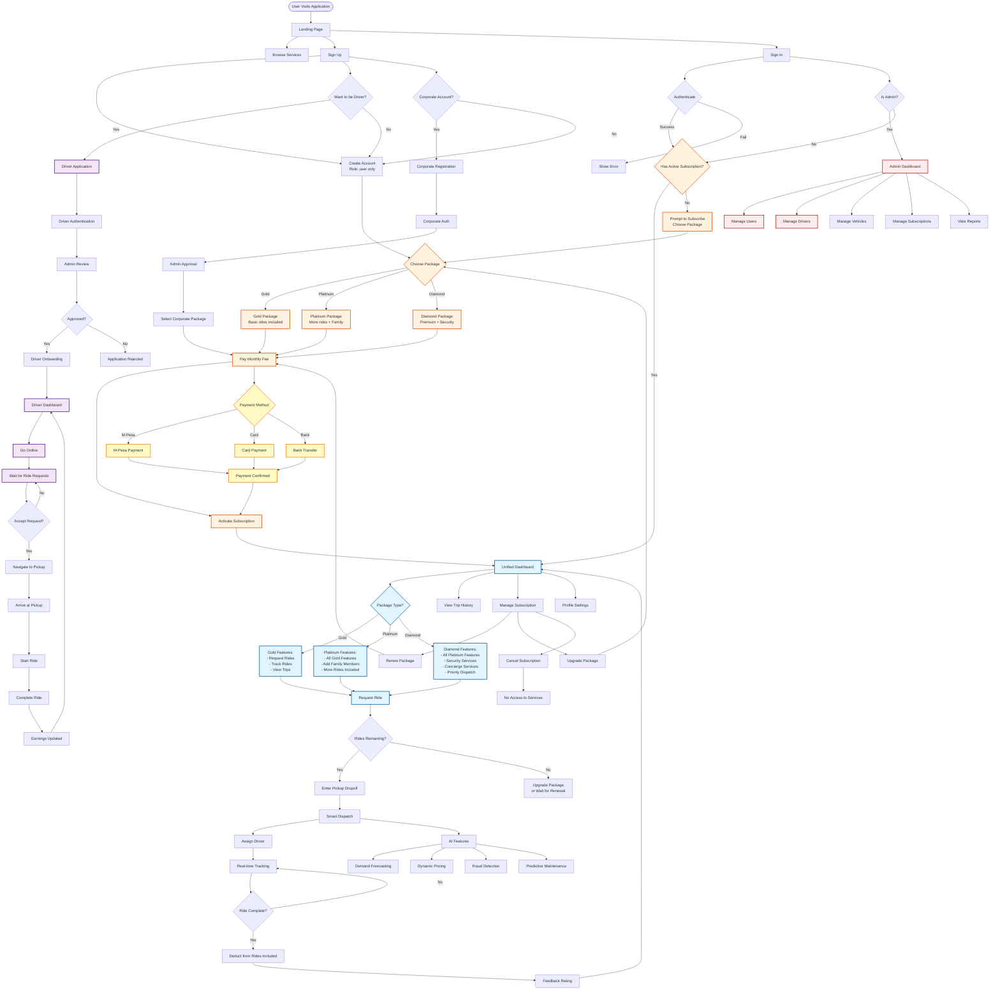

# LuxeRide Application Flow - CORRECTED Architecture

## Simplified Subscription-Based Model



## Key Architectural Principles

### 1. Single User Type
- **ALL users** have role: `'user'` (no `'vip_user'`)
- Access determined by **subscription**, not role

### 2. Mandatory Subscription
- **No subscription = No access**
- Users MUST choose package during signup
- Dashboard checks: `subscription !== null` not `role === 'vip_user'`

### 3. Unified Dashboard
- **ONE dashboard** for all users
- Features unlocked by `package_type`:
  - Gold: Basic features
  - Platinum: Gold + Family features
  - Diamond: Platinum + Security + Concierge

### 4. Simple Flow
```
Sign Up → Choose Package → Pay → Access Dashboard → Request Rides
```

### 5. No Per-Ride Pricing
- **Subscription-based only**
- Rides deducted from monthly allowance
- No individual fare calculation per ride
- No payment per ride (already paid in subscription)

## Differences from Current Implementation

| Current (Wrong) | Corrected (Right) |
|----------------|-------------------|
| Role: `'user'` vs `'vip_user'` | Role: `'user'` only |
| User Dashboard + VIP Dashboard | Single Unified Dashboard |
| Check role AND subscription | Check subscription only |
| Per-ride payment | Monthly subscription only |
| Complex pricing logic | Simple: rides included in package |

## Benefits

1. **Simpler Codebase**: One user type, one dashboard
2. **Clearer UX**: Choose package → Get access
3. **Easier Maintenance**: Less conditional logic
4. **Better Business Model**: Predictable monthly revenue
5. **Scalable**: Easy to add new package tiers

