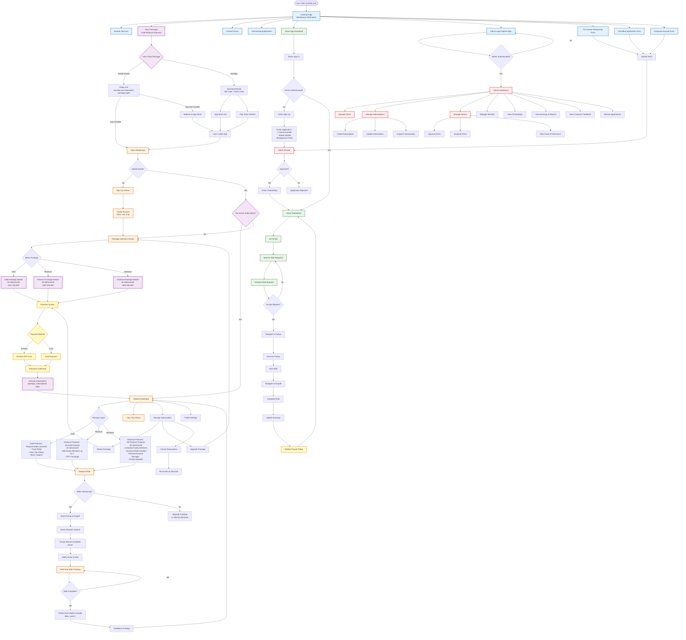

# LuxeRide Application Flow - Updated Architecture

## Mobile-First Subscription-Based Model



## Key Architectural Changes

### 1. Web Application (luxeride.com)
**Purpose:** Marketing & Admin Only

**Available:**
- ✅ Landing page with package showcase
- ✅ Contact forms
- ✅ Partnership applications (Car Owner, Chauffeur, Corporate)
- ✅ Admin dashboard (`/admin`)
- ✅ About/Contact pages

**Removed:**
- ❌ User sign up/login (mobile-only)
- ❌ User dashboard (mobile-only)
- ❌ Payment processing (mobile-only)
- ❌ Per-ride booking (subscription-based only)

### 2. Mobile Application
**Purpose:** All User Features

**Flow:**
```
Download App → Sign Up → Select Package → Pay → Dashboard → Request Rides
```

**Features:**
- Package selection (Gold/Platinum/Diamond)
- Payment processing
- User dashboard
- Request rides
- Track rides
- Manage subscription
- Trip history

### 3. Database Architecture
- **Role:** All users have `role = 'user'` (no `'vip_user'`)
- **Access:** Determined by `package_subscriptions` table
- **Constraint:** `role IN ('user', 'driver', 'admin', 'security')`

### 4. Package-Based Access
- **Gold:** 20 rides/month, basic features
- **Platinum:** 40 rides/month, family members, concierge
- **Diamond:** 60 rides/month, unlimited family, security, priority

### 5. Flow Summary

**Web:**
```
Landing → Browse → See Packages → Download App → (Everything else in mobile app)
```

**Mobile:**
```
App → Sign Up → Select Package → Pay → Dashboard → Request Rides → Track → Complete
```

**Admin:**
```
Admin Login → Dashboard → Manage Users/Subscriptions/Drivers/Vehicles
```

## Differences from Previous Flow

| Previous | Updated |
|----------|---------|
| Web signup/login | Mobile-only |
| Web user dashboard | Mobile-only |
| Role: `'user'` vs `'vip_user'` | Role: `'user'` only |
| Package selection on web | Redirects to app stores |
| Per-ride payment | Monthly subscription only |
| Check role AND subscription | Check subscription only |

