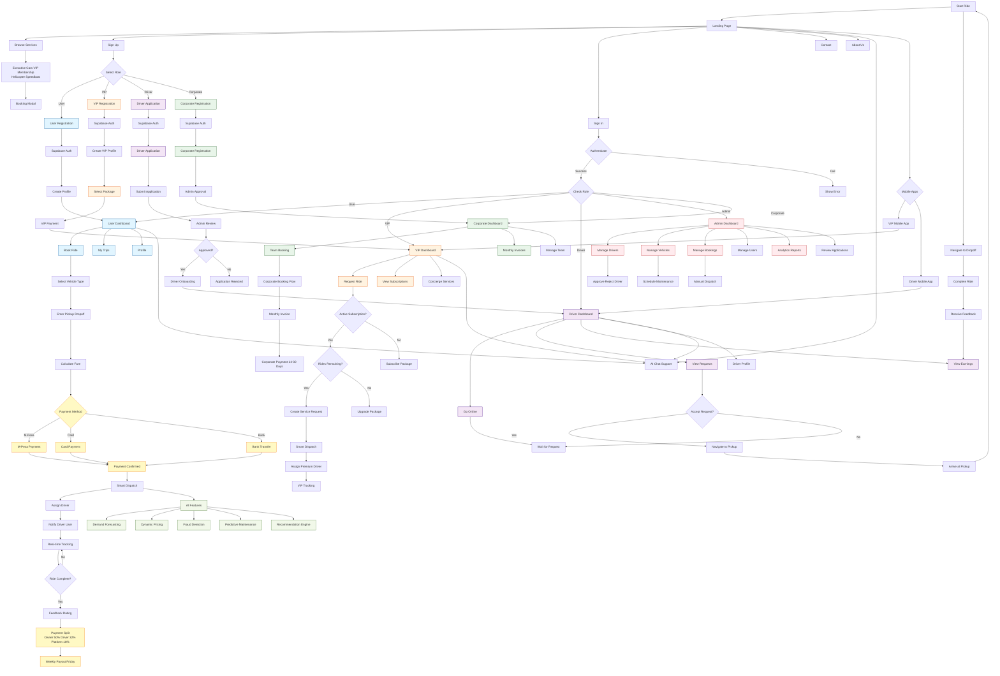

# LuxeRide Application Flow

## Key Components

### Authentication & Authorization
- **Supabase Auth**: Handles all user authentication
- **Role-Based Access**: User, VIP User, Driver, Admin, Corporate
- **Session Management**: Real-time session tracking

### Booking & Dispatch System
- **Smart Dispatch**: AI-powered driver assignment
- **Real-time Tracking**: Live location updates
- **Dynamic Pricing**: AI-based fare calculation
- **Multiple Vehicle Tiers**: Gold, Platinum, Diamond

### Payment Processing
- **Payment Methods**: M-Pesa, Cards, Bank Transfer
- **Automated Split**: Owner (50%), Driver (32%), Platform (18%)
- **Payout Cycles**: Weekly (Friday) or Instant (with fee)
- **Corporate Billing**: Monthly invoices with 14-30 day terms

### AI Features
- **Demand Forecasting**: Predict ride demand
- **Dynamic Pricing**: Adjust fares based on demand
- **Fraud Detection**: Monitor suspicious activities
- **Predictive Maintenance**: Schedule vehicle maintenance
- **Recommendation Engine**: Suggest optimal routes/services

### Platforms
- **Web Application**: Main landing page and admin dashboard
- **VIP Web Portal**: Dedicated VIP user interface
- **Mobile Apps**: React Native apps for VIP users and drivers

